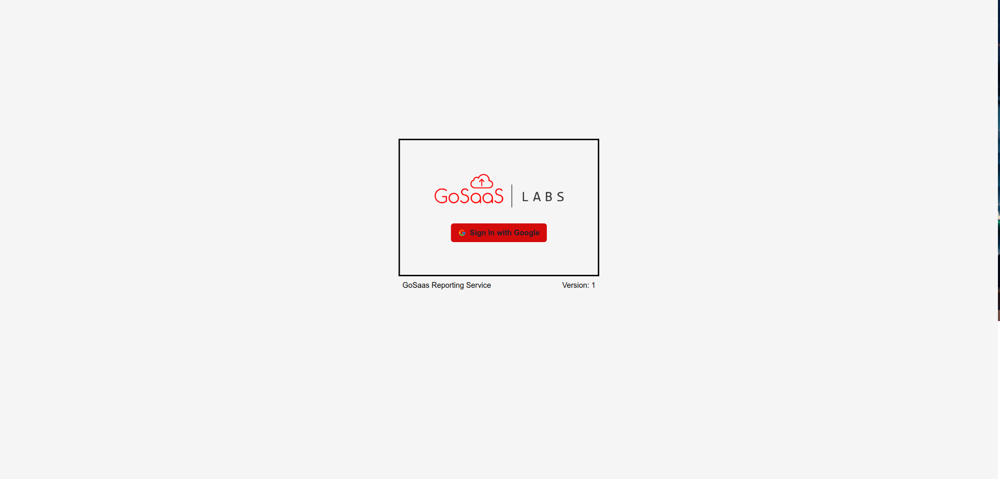
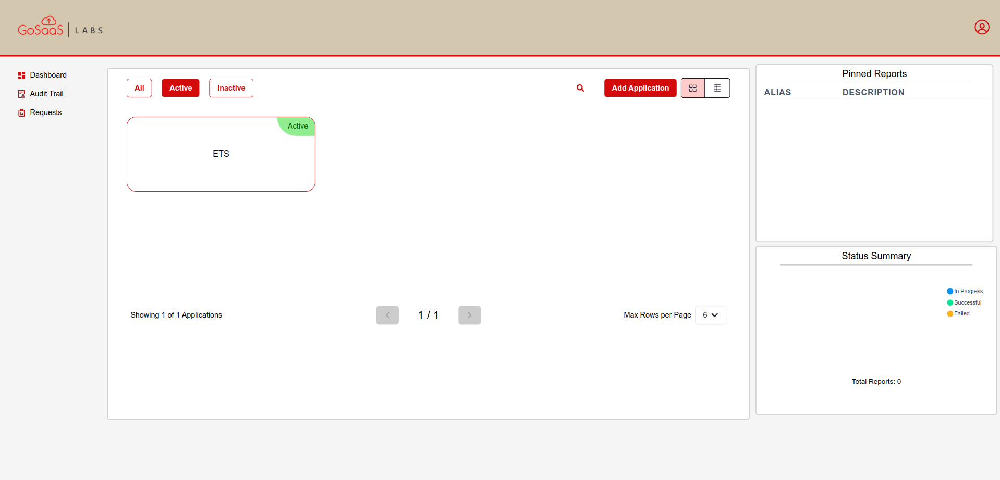
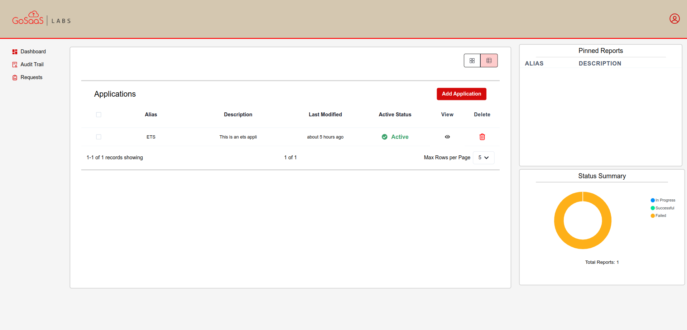
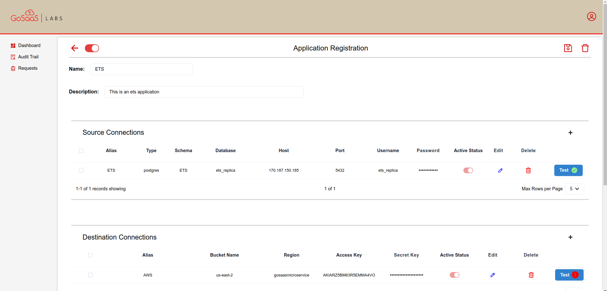
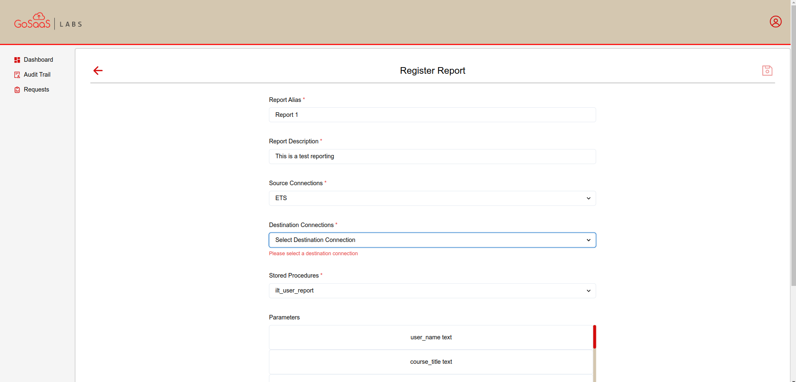
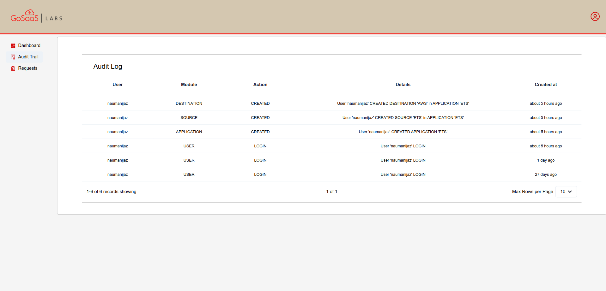
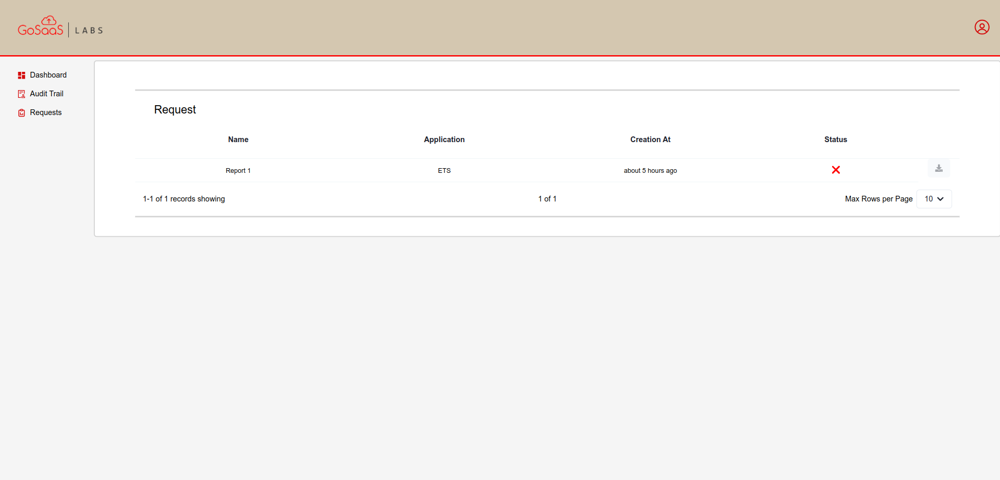

# GoSaaS Reporting Service

## Project Details

GoSaaS aims to develop a unified reporting microservice that addresses the current challenges posed by diverse reporting mechanisms across multiple products. The primary objective is to centralize report generation, improve scalability for large reports, and introduce additional features such as product/report registration tracking.

## Goals

The core goals of the GoSaaS Reporting Service project are:

### Centralized Reporting

- **Consolidation:** Eliminate redundant report generation processes by establishing a single access point for all report types.
- **Efficiency:** Streamline the reporting process, reducing manual intervention and ensuring consistency across all reports.
- **Time Savings:** Minimize the time spent on manual report creation, freeing up resources for other tasks.

### Scalability

- **High Performance:** Design the reporting system to handle large volumes of data and numerous report requests without compromising performance.
- **Adaptability:** Ensure the system can accommodate future growth in data volumes and user demand.
- **Resource Optimization:** Efficiently utilize system resources to maximize the number of reports that can be generated concurrently.

By achieving these goals, GoSaaS will provide a robust, efficient, and scalable reporting solution that empowers users to generate insights and make data-driven decisions with ease.

## Screenshots of the Application

  
_Login page where users can enter their credentials._

  
_Home page displaying data in a grid view._

  
_Home page showing data in a table view format._

  
_Detailed view of a selected application._

  
_Reports page where users can generate and view reports._

  
_Audit log page showing user activities and system events._

  
_Requests page displaying pending and processed requests._

## How to run

1. Start up your Docker Desktop.
2. Run the command `docker-compose up --build` to build and start the services.
3. Once the services are running, you can access the application through the following URLs:
   - **Local:** [http://localhost:5173/](http://localhost:5173/)
   - **Network:** [http://172.18.0.5:5173/](http://172.18.0.5:5173/)

Make sure your Docker environment is properly set up, and all required dependencies are installed before running the service.
